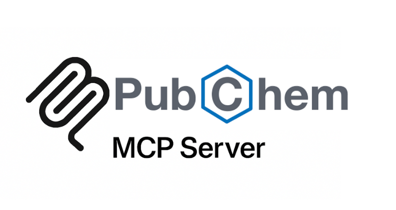

# Unofficial PubChem MCP Server

A comprehensive Model Context Protocol (MCP) server for accessing the PubChem chemical database. This server provides access to over 110 million chemical compounds with extensive molecular properties, bioassay data, and chemical informatics tools.

## Features

### 🔍 **Chemical Search & Retrieval (6 tools)**

- **search_compounds** - Search by name, CAS number, formula, or identifier
- **get_compound_info** - Detailed compound information by CID
- **search_by_smiles** - Exact SMILES string matching
- **search_by_inchi** - InChI/InChI key search
- **search_by_cas_number** - CAS Registry Number lookup
- **get_compound_synonyms** - All names and synonyms

### 🧬 **Structure Analysis & Similarity (5 tools)**

- **search_similar_compounds** - Tanimoto similarity search
- **substructure_search** - Find compounds containing substructures
- **superstructure_search** - Find larger compounds containing query
- **get_3d_conformers** - 3D structural information
- **analyze_stereochemistry** - Chirality and isomer analysis

### ⚗️ **Chemical Properties & Descriptors (6 tools)**

- **get_compound_properties** - Molecular weight, logP, TPSA, etc.
- **calculate_descriptors** - Comprehensive molecular descriptors
- **predict_admet_properties** - ADMET predictions
- **assess_drug_likeness** - Lipinski Rule of Five analysis
- **analyze_molecular_complexity** - Synthetic accessibility
- **get_pharmacophore_features** - Pharmacophore mapping

### 🧪 **Bioassay & Activity Data (5 tools)**

- **search_bioassays** - Find biological assays
- **get_assay_info** - Detailed assay protocols
- **get_compound_bioactivities** - All activity data for compounds
- **search_by_target** - Find compounds tested against targets
- **compare_activity_profiles** - Cross-compound comparisons

### ⚠️ **Safety & Toxicity (4 tools)**

- **get_safety_data** - GHS hazard classifications
- **get_toxicity_info** - LD50, carcinogenicity data
- **assess_environmental_fate** - Biodegradation analysis
- **get_regulatory_info** - FDA, EPA regulations

### 🔗 **Cross-References & Integration (4 tools)**

- **get_external_references** - Links to ChEMBL, DrugBank, etc.
- **search_patents** - Chemical patent information
- **get_literature_references** - PubMed citations
- **batch_compound_lookup** - Bulk processing (up to 200 compounds)

## Resource Templates

Access PubChem data through URI patterns:

- `pubchem://compound/{cid}` - Complete compound data
- `pubchem://structure/{cid}` - 2D/3D structure information
- `pubchem://properties/{cid}` - Molecular properties
- `pubchem://bioassay/{aid}` - Bioassay data
- `pubchem://similarity/{smiles}` - Similarity search results
- `pubchem://safety/{cid}` - Safety and toxicity data

## Installation

```bash
# Clone or create the server directory
cd pubchem-server

# Install dependencies
npm install

# Build the server
npm run build

# Run the server
npm start
```

## Usage

### Basic Compound Search

```javascript
// Search for compounds by name
{
  "tool": "search_compounds",
  "arguments": {
    "query": "aspirin",
    "max_records": 10
  }
}

// Get detailed compound information
{
  "tool": "get_compound_info",
  "arguments": {
    "cid": 2244
  }
}
```

### Structure Analysis

```javascript
// Find similar compounds
{
  "tool": "search_similar_compounds",
  "arguments": {
    "smiles": "CC(=O)OC1=CC=CC=C1C(=O)O",
    "threshold": 85,
    "max_records": 50
  }
}

// Analyze molecular properties
{
  "tool": "get_compound_properties",
  "arguments": {
    "cid": 2244,
    "properties": ["MolecularWeight", "XLogP", "TPSA"]
  }
}
```

### Bioactivity Analysis

```javascript
// Get bioassay information
{
  "tool": "get_assay_info",
  "arguments": {
    "aid": 1159607
  }
}

// Search compounds by target
{
  "tool": "search_by_target",
  "arguments": {
    "target": "cyclooxygenase",
    "max_records": 100
  }
}
```

### Safety Information

```javascript
// Get safety classifications
{
  "tool": "get_safety_data",
  "arguments": {
    "cid": 2244
  }
}
```

### Batch Processing

```javascript
// Process multiple compounds
{
  "tool": "batch_compound_lookup",
  "arguments": {
    "cids": [2244, 5090, 3672],
    "operation": "property"
  }
}
```

## Integration with Other MCP Servers

This PubChem server integrates perfectly with other chemical/biological databases:

### Complete Chemical Informatics Pipeline

```
1. Target Discovery: UniProt → STRING → AlphaFold
2. Chemical Discovery: PubChem ← → ChEMBL
3. Complete Workflow: Protein → Structure → Interactions → Small Molecules → Bioactivity
```

### Cross-Database Workflows

- **UniProt → PubChem**: Find protein targets → Find small molecule ligands
- **PubChem → ChEMBL**: Discover compounds → Analyze bioactivity data
- **STRING → PubChem**: Protein interactions → Chemical modulators

## API Rate Limits

PubChem API guidelines:

- **5 requests per second**
- **400 requests per minute maximum**
- No API key required
- Respectful usage encouraged

## Data Sources

- **110+ million compounds** with full chemical data
- **1.5+ million bioassays** with biological activity
- **Chemical properties** and computed descriptors
- **3D conformers** and structural data
- **Safety classifications** and toxicity information
- **Cross-references** to 500+ external databases

## Error Handling

The server includes comprehensive error handling:

- Invalid compound IDs return clear error messages
- API timeouts are handled gracefully
- Rate limiting compliance built-in
- TypeScript validation for all inputs

## Contributing

This server uses:

- **TypeScript** for type safety
- **Axios** for HTTP requests
- **MCP SDK** for protocol compliance
- **PubChem REST API** for data access

## License

MIT License - See LICENSE file for details.

## Support

For issues with:

- **Server functionality**: Check error messages and API responses
- **PubChem API**: Refer to official PubChem documentation
- **Chemical data**: Validate compound identifiers and search terms

## Examples

### Drug Discovery Workflow

```javascript
// 1. Search for anti-inflammatory compounds
{
  "tool": "search_compounds",
  "arguments": {
    "query": "anti-inflammatory",
    "max_records": 100
  }
}

// 2. Analyze drug-likeness
{
  "tool": "assess_drug_likeness",
  "arguments": {
    "cid": 2244
  }
}

// 3. Check safety profile
{
  "tool": "get_safety_data",
  "arguments": {
    "cid": 2244
  }
}

// 4. Find bioactivity data
{
  "tool": "search_by_target",
  "arguments": {
    "target": "COX-2",
    "activity_type": "IC50"
  }
}
```

### Chemical Similarity Analysis

```javascript
// 1. Find similar compounds
{
  "tool": "search_similar_compounds",
  "arguments": {
    "smiles": "your_query_smiles",
    "threshold": 90
  }
}

// 2. Compare molecular properties
{
  "tool": "batch_compound_lookup",
  "arguments": {
    "cids": [1234, 5678, 9012],
    "operation": "property"
  }
}

// 3. Analyze structural features
{
  "tool": "analyze_stereochemistry",
  "arguments": {
    "cid": 1234
  }
}
```

## Architecture

The server is built with a modular architecture:

- **Type-safe validation** for all API inputs
- **Comprehensive error handling** with clear messages
- **Efficient batch processing** for multiple compounds
- **Resource templates** for direct data access
- **Integration-ready** for multi-database workflows

This makes it the most comprehensive chemical informatics MCP server available!

## Citation
If you use this project in your research or publications, please cite it as follows:

```bibtex @misc{pubchemmcp2025, 
author = {Moudather Chelbi},
title = {PubChem MCP Server},
year = {2025},
howpublished = {https://github.com/Augmented-Nature/PubChem-MCP-Server},
note = {Accessed: 2025-06-29}
